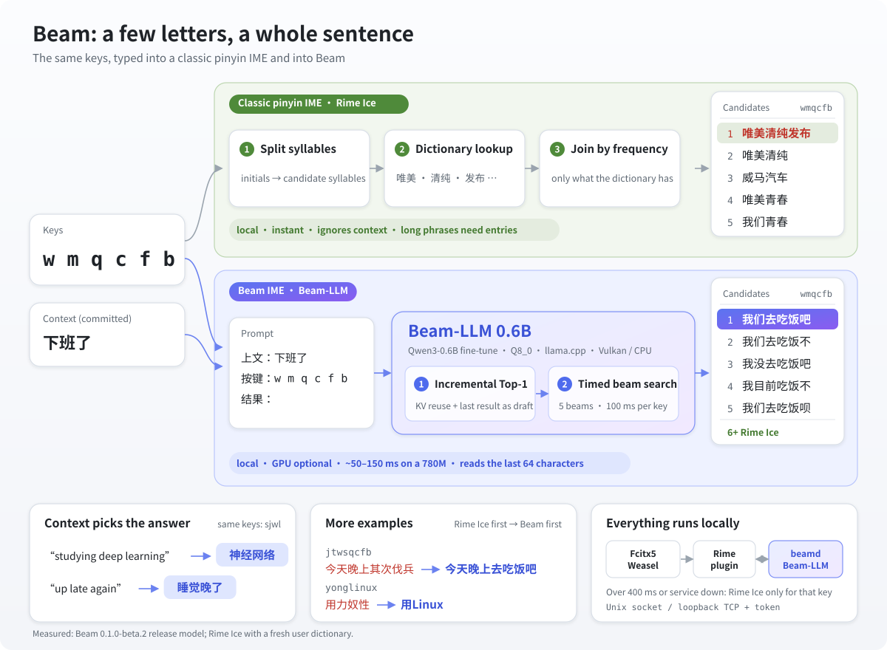

# Beam IME

A local Chinese input method powered by a keys-conditioned 0.6B language model.
Type initials, partial/full pinyin, or Chinese-English mixed input. Beam returns
whole-input candidates and keeps Rime Ice available as a fallback.

**Beta 0.1.0-beta.2:** x86_64 Arch Linux, Ubuntu 24.04, Fedora 44 and Windows 11.
[Downloads](https://github.com/IrisRainbowNeko/beam-ime/releases).

A classic pinyin IME expands each initial into syllables, looks them up and joins words by
frequency, so long abbreviations only work when the dictionary happens to have the phrase.
Beam gives the context and the keys to Beam-LLM, a local Qwen3-0.6B fine-tune (Q8_0, llama.cpp),
which writes the whole sentence: an incremental Top-1 first, then a beam search bounded to
100 ms per key. Nothing leaves the computer, and if Beam takes over 400 ms the Rime Ice
candidates are shown for that key. All candidates in the figure are measured.

- Linux: install the distribution package, run `beamctl model-install --download`,
  run `beamctl setup`, redeploy Rime and choose Beam.
- Windows: run the light or offline installer. It installs the compatible
  Weasel version when needed. The offline installer includes the model.
- The model runs locally through llama.cpp with an optional Vulkan backend and
  a CPU fallback. Context is limited to text committed in the current Rime session.

[Build instructions](docs/build.md), [architecture](docs/architecture.md),
[model card](docs/models/model-card.md), [privacy](PRIVACY.md).

Build: `bash tools/build.sh release`. Model-free tests: `bash tools/build.sh tests`.
Source code is Apache-2.0; bundled dependencies keep their original licenses.
