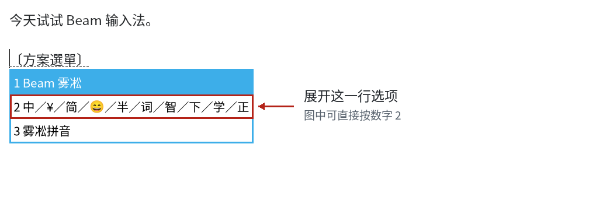
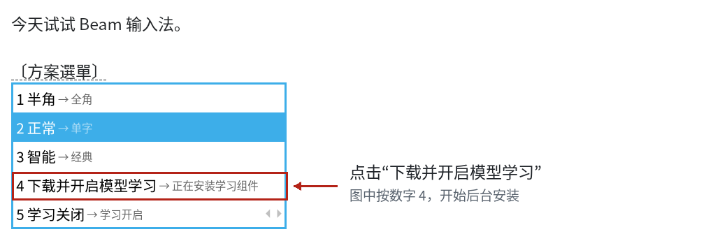
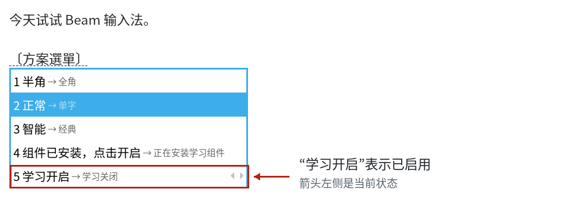
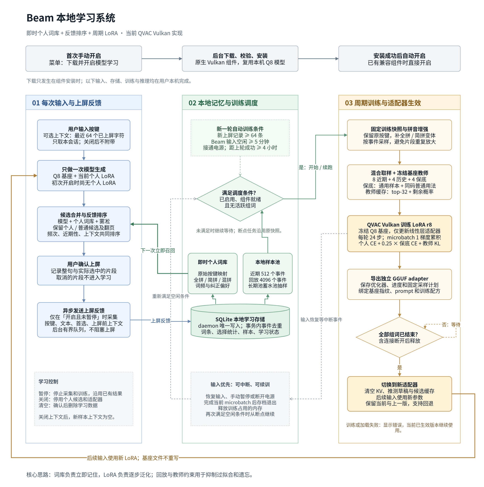

# Beam 输入法

用首字母、部分拼音、全拼或中英文混输，直接生成整句候选。
Beam 在本机运行 0.6B 语言模型，通过 Rime 接入桌面输入法；雾凇候选作为日常输入的补充。

[下载安装包](https://github.com/IrisRainbowNeko/beam-ime/releases) · [开启本地学习（图文）](#本地个性化学习) · [English](README.en.md) · [安装教程](docs/install-linux.md) · [Windows](docs/install-windows.md)

## 工作原理


传统拼音输入法先把首字母展开成音节，再查词典、按词频拼接，长串首字母只有词库恰好收录时才能拼对，也不看上文。
Beam 把上文和按键直接交给本机的 Beam-LLM（基于 Qwen3-0.6B 微调，Q8_0 量化，llama.cpp 运行），一次生成整句：
每次按键先增量算出首选（复用 KV 缓存，并把上一次的结果当草稿验证），再在 100 ms 预算内用 beam search 补齐其余候选。
所以同样的 `sjwl`，上文是「我在学深度学习」时首选「神经网络」，上文是「昨晚又熬夜了」时首选「睡觉晚了」。
模型在本机运行，按键和上文都不离开电脑；超过 400 ms 或服务不可用时这次按键只显示雾凇候选，打字不会被卡住。
图中的候选均为实测结果，生成脚本见 `tools/render_diagrams.py`。

## 下载和安装

当前版本：**0.2.1**。面向 x86_64 的 Arch Linux、Ubuntu 24.04、Fedora 44 和 Windows 11。
Linux 使用 Fcitx5-Rime，Windows 使用小狼毫 Weasel 0.17.4。

| 系统 | 轻量包 | 离线包 | 教程 |
|---|---|---|---|
| Arch Linux | [下载 .pkg.tar.zst](https://github.com/IrisRainbowNeko/beam-ime/releases/download/v0.2.1/beam-ime-0.2.1-arch-x86_64.pkg.tar.zst) | [下载 .tar](https://github.com/IrisRainbowNeko/beam-ime/releases/download/v0.2.1/beam-ime-0.2.1-arch-x86_64-offline.tar) | [Linux 安装](docs/install-linux.md) |
| Ubuntu 24.04 | [下载 .deb](https://github.com/IrisRainbowNeko/beam-ime/releases/download/v0.2.1/beam-ime-0.2.1-ubuntu24.04-amd64.deb) | [下载 .tar](https://github.com/IrisRainbowNeko/beam-ime/releases/download/v0.2.1/beam-ime-0.2.1-ubuntu24.04-x86_64-offline.tar) | [Linux 安装](docs/install-linux.md) |
| Fedora 44 | [下载 .rpm](https://github.com/IrisRainbowNeko/beam-ime/releases/download/v0.2.1/beam-ime-0.2.1-fedora44-x86_64.rpm) | [下载 .tar](https://github.com/IrisRainbowNeko/beam-ime/releases/download/v0.2.1/beam-ime-0.2.1-fedora44-x86_64-offline.tar) | [Linux 安装](docs/install-linux.md) |
| Windows 11 | [下载 setup.exe](https://github.com/IrisRainbowNeko/beam-ime/releases/download/v0.2.1/Beam-0.2.1-windows-x64-setup.exe) | [下载 offline.exe](https://github.com/IrisRainbowNeko/beam-ime/releases/download/v0.2.1/Beam-0.2.1-windows-x64-offline.exe) | [Windows 安装](docs/install-windows.md) |

轻量包在安装或首次配置时下载模型。离线完整包包含同一个模型；Windows 离线包也包含小狼毫。
Linux 的离线包仍需要系统已有 Fcitx5-Rime 及发行版依赖。

建议至少 4 GiB 内存、3 GiB 可用磁盘空间。GPU 不是必需项；Vulkan 不可用时使用 CPU。

Linux 安装程序包后，以桌面用户运行：

```sh
beamctl model-install --download
beamctl setup
```

在 Rime 菜单中重新部署，然后选择 **Beam 雾凇**。Windows 安装器会完成小狼毫、模型和方案配置。

## 使用

- 首字母：`nhsj`；全拼：`nihao`；混合输入：`yonglinux`。
- 学习关闭时，前面最多五个候选来自模型，后面接雾凇词典候选；开启后合并个人词库，并在首屏保留普通候选。
- 菜单中的「智能 / 经典」开关可切回雾凇。
- 模型服务不可用或响应超时后，当前按键自动使用雾凇候选。
- 上下文来自当前 Rime 会话已经上屏的文字，最多取最近 64 字；可完全关闭。

模型适合中文日常输入和中英混输。简拼会有歧义，补充几个拼音字母通常能缩小候选范围。
数字、URL、特殊符号和英文词前缀补全不属于模型的完整输入能力，继续由 Rime 处理。

本次发布模型的实际无上下文示例：`nihao` → `你好`，`yonglinux` → `用Linux`，
`nhsj` → `你换手机`。最后一例也说明简拼不是唯一映射；详见 [测试记录](docs/testing.md)。

## 本地个性化学习

### 在哪里开启

**入口在打字时弹出的 Rime「方案选单」中。** 安装 Beam **0.2.1 或更新版本**后，按下面的步骤操作。
截图为 Linux Fcitx5-Rime 的实际界面；Windows 小狼毫使用相同的 Rime 选单，皮肤、繁简字和每页条目数可能不同。

**1. 在输入框中打开方案选单。**

打开记事本、文本编辑器或浏览器输入框，点击输入区域，让光标出现。
Windows 切换到**小狼毫**，Linux 切换到 Fcitx5 的 **Rime / 中州韵**，然后按 **`F4`**。
也可以按 <kbd>Ctrl</kbd> + <kbd>&#96;</kbd>（反引号键，通常在数字 `1` 左边）；笔记本可能需要按 `Fn + F4`。
如果当前方案还不是 **Beam 雾凇**，先在选单中选择它，再按一次 `F4`。

**2. 展开折叠的开关。**

找到 **「中／￥／简／……」** 这一行，点击它，或按它前面的数字（下图是 `2`）。
这一行包含当前方案的开关；如果选单已经逐项显示开关，直接继续下一步。



**3. 翻页，点击「下载并开启模型学习」。**

展开后按 **`PageDown`**，或点击候选框中的下一页箭头，直到看到 **「下载并开启模型学习」**。
点击该行，或按它前面的数字（下图是 `4`，以自己菜单中的编号为准）。
首次点击即确认联网下载并安装：Linux 约 **26 MiB**，Windows 约 **34 MiB**，安装完成后自动开启。
已有兼容组件时，会显示「组件已安装，点击开启」，点击即可启用。



**4. 确认显示「学习开启」。**

安装在后台进行，可以继续打字。稍后重新打开选单、展开并翻页，看到 **「学习开启 → 学习关闭」** 就说明已经开启。
**箭头左侧是当前状态，右侧是点击后要切换到的状态**；此时再次点击这一行会关闭学习。
「组件已安装，点击开启」是可再次使用的安装入口，是否已开启请以下面的「学习开启」为准。



只需要即时个人词库时，可直接点击 **「学习关闭 → 学习开启」**，无需下载训练组件。
新词确认上屏后即可召回，支持全拼、简拼、混拼和句内组合；模型 LoRA 会在满足空闲条件后训练。

**找不到或开启失败？**

- 按 `F4` 没反应：先点击可输入文字的区域，并确认已切换到小狼毫或 Rime；再试 <kbd>Ctrl</kbd> + <kbd>&#96;</kbd>。
- 选单里没有学习项：确认当前方案是 **Beam 雾凇**，展开开关并继续翻页；从旧版升级后，重新部署 Rime，再打开选单。
- 显示「正在安装学习组件」：等待后台安装，稍后关闭并重新打开选单查看状态。
- 显示「安装失败，点此重试」：恢复网络后点击重试；详细原因在 Linux 的 `beamctl learn status` 或 Windows 开始菜单的 `Beam / Learning Status` 中查看。

### 学习如何工作

上述一键安装使用匹配当前基座的 QVAC Vulkan 原生组件，直接复用已安装的 Q8 GGUF。
学习组件不包含 Python、PyTorch、CUDA runtime 或额外的完整精度权重，需要可用的 Vulkan 显卡驱动。
默认累计 64 条新上屏记录、无 Beam 输入 5 分钟且接通电源后执行 24 步 r8 LoRA 更新，输入恢复后暂停。
暂停保留已有词库和适配器；关闭个性化会停用它们。清空学习需要显式确认。
操作见 [Linux 教程](docs/install-linux.md#本地个性化学习) 和 [Windows 教程](docs/install-windows.md#本地个性化学习)，
配方与打包见 [模型开发](docs/models/training.md#个人-lora-训练组件)。



[查看可编辑流程图](docs/images/learning-system.drawio)

## 构建和开发

```sh
git clone https://github.com/IrisRainbowNeko/beam-ime.git
cd beam-ime
bash tools/build.sh release
```

依赖和完整命令见 [编译指南](docs/build.md)。只运行无模型测试：

```sh
bash tools/build.sh tests
```

| 目录 | 内容 |
|---|---|
| `src/engine` | llama.cpp 推理、按键与本机通信 |
| `src/daemon` | `beamd` 服务 |
| `src/rime` | 插件与雾凇方案 |
| `src/learning` | SQLite 个人词库、拼音索引、排序和训练调度 |
| `packaging` | Linux / Windows 打包和安装 |
| `tools/models` | 训练、评测、GGUF 工具 |
| `tests` | 核心、配置、安装恢复和可选模型测试 |

[架构与协议](docs/architecture.md) · [配置与排错](docs/troubleshooting.md) · [模型说明](docs/models/model-card.md) · [构建记录](docs/testing.md)

## 项目说明

本项目是 Beam 研究实现的产品化版本，保留 keys-conditioned LLM、KV 复用、草稿验证和限时 beam search。
程序自写代码使用 Apache-2.0；Rime、小狼毫、雾凇和其他依赖保留各自许可，见 [第三方说明](THIRD_PARTY_NOTICES.md)。

输入推理在本机完成，默认不记录按键或候选文本，也不上传输入内容。详见 [隐私说明](PRIVACY.md)。
反馈问题请附 `beamctl doctor` 或 Windows 诊断输出，参见 [贡献指南](CONTRIBUTING.md)。
